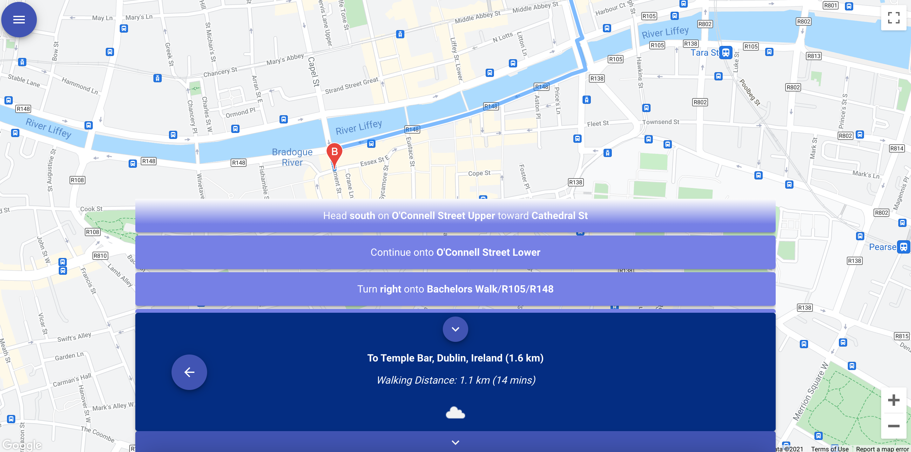

# Dublin-Bus-App

This project involves analysing historic Dublin Bus and weather data in order to create
dynamic travel time estimates. Based on data analysis of historic Dublin Bus data,
the web application, when presented with any bus route, departure time, the day of the week and
current weather conditions, produces an accurate estimate of travel time for the complete
route and sections of the route.
The site is built as a desktop-first application but is responsive to allow it to work seamlessly
on smaller view ports like phones and tablets.

The finished web application can be viewed at https://d11kr48bq6bduz.cloudfront.net/

## Installation Instructions

Clone repository

`cd` into project folder

Activate virtualenv and run `pip install requirements.txt`.

`cd` into frontend folder, run `npm install` to install all node modules.

When both have been installed, `cd` into backend folder where manage.py is located and
run `python manage.py runserver`.

Then `cd` into the frontend folder and run `npm run start`.

This will then open `localhost:3000` in the web browser.

## Some Application Features

### To Walk or to Bus

### Journey Step by Step

### Route Pricing

### Favourites

### Dark Mode

#### The app was made by Adam McCarthy, Ciara Purcell, Maria Leech and Turlough Cooke.
